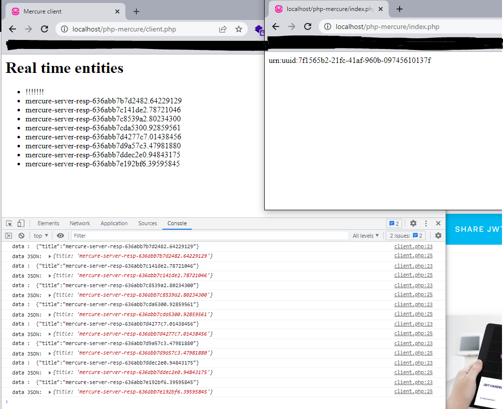

# Notes

- https://github.com/dunglas/mercure/releases (Mercure github releases)
```
mercure_0.14.1_Windows_x86_64.zip               14.5 MB             Sep 13
```
- Download and extract in  `server`
- Launch **Mercure server** : `$ MERCURE_PUBLISHER_JWT_KEY='!ChangeThisMercureHubJWTSecretKey!' MERCURE_SUBSCRIBER_JWT_KEY='!ChangeThisMercureHubJWTSecretKey!' ./server/mercure.exe run -config ./server/Caddyfile.dev`
- https://github.com/dunglas/mercure - Mercure Git repo docs
- https://github.com/symfony/mercure - Mercure Component
- https://symfony.com/blog/symfony-gets-real-time-push-capabilities - (Symfony Gets Real-time Push Capabilities!)
- Mercure server : `https://localhost/.well-known/mercure`
- PHP Server notification dispatcher : `http://localhost/php-mercure/index.php`
- Static Client : `http://localhost/php-mercure/client.php`


**Subscribing to updates from a web browser**
- https://mercure.rocks/docs/getting-started (Mercure documentation)
- Static HTML client to recieve notification - `client.php`

```js
// The subscriber subscribes to updates for the https://example.com/users/dunglas topic
// and to any topic matching https://example.com/books/{id}
const url = new URL('https://localhost/.well-known/mercure');
url.searchParams.append('topic', 'https://localhost/demo/books/1.jsonld');
url.searchParams.append('topic', 'https://example.com/users/dunglas');
// The URL class is a convenient way to generate URLs such as https://localhost/.well-known/mercure?topic=https://example.com/books/{id}&topic=https://example.com/users/dunglas

const eventSource = new EventSource(url);

// The callback will be called every time an update is published
eventSource.onmessage = e => console.log(e); // do something with the payload
```

---

